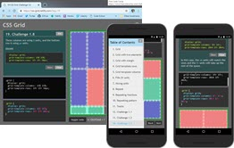

# CSS Grid Practice Environment

This is a CSS Grid learning and practice environment. It provides a series of follow-along lessons and was inspired by [Grid Critters](https://gridcritters.com) learning game.



This proof-of-concept was written from the ground up using vanilla JavaScript. It provides the following:

- Dynamic in-page code editor
- Syntax highlighting
- CSS environment to learn CSS Grid Layout

You can test it at the following link.

- Netlify - [https://css-grid.netlify.app/](https://css-grid.netlify.app/)
- Practice Environment - [https://james-priest.github.io/grid-critters-code/](https://james-priest.github.io/grid-critters-code/)

See below for [screenshots](#screenshots).

## Installation

Clone the repository and change directories. 

```bash
$ git https://github.com/james-priest/grid-critters-code.git
$ cd grid-critters-code
```

No build environment is necessary. This can be run from the file system but ideally it should be run from any local http server.

Here are a couple links showing how to do this.

- [Simple HTTP Server](http://jasonwatmore.com/post/2016/06/22/nodejs-setup-simple-http-server-local-web-server) - Runs on Node.js 
- [How to run things locally](https://threejs.org/docs/#manual/en/introduction/How-to-run-things-locally) - Instructions for , Node.js, Python, & Ruby


## Usage

The app has two main JavaScript pages.

- mce_ta.js - This is responsible for the code editor and all event handling within the app. Any new functionality would be added here.
- pages.js - This acts as the data source. Any new pages, lessons, or quizzes would be added here.
- constants.js - provides a lists of html elements, css constants, and css functions used for syntax highlighting within the editor.

## Screenshots


